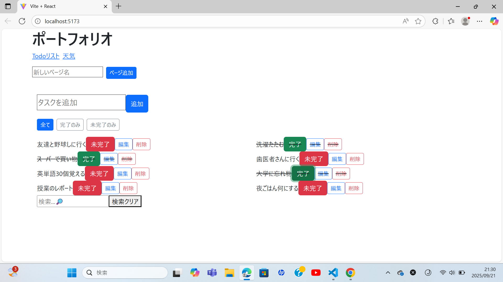

# ToDo + 天気要素アプリ 

フロントエンド学習用に制作した ToDo アプリです。  
タスク管理に加えて、OpenWeather API を利用して「今日の東京の天気」も表示します。  
フロントエンド長期インターンを目指して、React/TypeScript の基礎を実践的に学びました。

## セットアップ手順
1. リポジトリを clone
 bash
git clone https://github.com/SogoTahara/todo_react.git
cd todo_react

2. インストール
npm install

3. サーバーを起動
npm run dev
http://localhost:5173 にアクセス

4. JSON Server を起動
npx json-server --watch db.json --port 3001

## リンク(Vercelでデプロイした動作確認ページ)
https://todo-react-git-main-sougos-projects-21194172.vercel.app?_vercel_share=1SJlTwKEj6fidNNj16YfoSbUF13xPEqN

## 見た目

## 機能
- ToDo の追加・編集・削除
- 完了/未完了の切り替え
- フィルタリング（全て / 完了 / 未完了）
- タスクの検索
- ページ追加
- OpenWeather API で東京の天気を取得

## 使用技術
- TypeScript
- React(useEffect + useReducer + React Router)
- Vite
- Bootstrap 5
- Axios
- json-server
- OpenWeather API
- vitest + React Testing Library

## 工夫した点 / 学び
- TypeScript で型定義を行い、安全な状態管理
- `json-server`を使ったデータ保存 
- API Key を `.env` ファイルで管理
- UI/UX 改善のため検索やフィルタリングを導入

## 今後やりたいこと
- 更なるテストコード
- UI改善やデザイン向上
- ログイン機能や、バックエンドとの連携

## 作者
大学2年 / フロントエンドエンジニア志望  
長期インターンを目指して学習中 🚀
