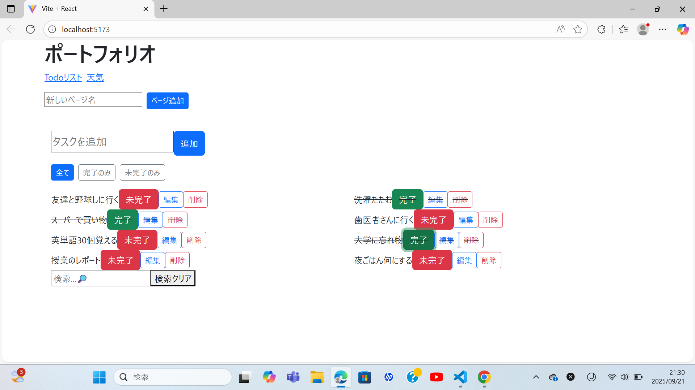

## ToDoアプリ 

シンプルな ToDo アプリです。
Cypressを用い、タスク操作やログインの流れなどを自動テストしています。

## 見た目

## 機能
- ToDo の追加・編集・削除
- フィルタリング（全て / 完了 / 未完了）
- タスクの検索
- ページ追加,削除
- OpenWeather API で天気を取得
- ログイン履歴の記録
- タスクの統計表示

## 認証機能
- Supabase Auth を利用したログイン / 新規登録
- ログインなしでもアプリ利用可能
- ログイン時はユーザーごとにデータを分離

## 自動テスト (Cypress) の設計方針
タスク追加時の不具合や、他人に勝手に操作されるなど、リスクベースの観点から優先度が高いと考えたものを以下のようにテスト設計しました。jstqbで学んだ内容を個人開発に当てはめる形にしています。

1. 境界値分析: タスク追加時のバリデーション

  - 検証内容: 0文字、1文字、30文字、31文字

  - 意図: 
    - UI崩れや、タスクを追加するというメイン機能であるため、重要な箇所だと考えました
    - 最小限の工数でテストするために境界値で実装しました

2. 状態遷移テスト: タスク管理

- 検証内容: 「未完了 → 完了 → 削除」の流れ
- 意図：
  - 単発の操作ではなく、一連の流れが壊れていないかを検証するため
  - 「削除できない」、「編集できない」という不具合は、使用感に与える影響が大きいと考えました

3. 異常系テスト
- 検証内容: 未ログイン状態での操作ブロックや、不正な入力に対するアラート表示
- 意図:
  -  未ログイン時の不正な操作はアプリの信頼性を失うため。
  - 不具合が起こりやすい箇所だと考えたため。

4. 外部API（OpenWeather）を利用した箇所のテスト
- 検証内容: APIからのデータ取得と、画面への反映
- 意図:
  -  環境変化で上手くいかなくなる事が多かった経験から、壊れやすい箇所と判断

今後の課題

- 「モバイル端末で入力欄をタップした時にキーボードが表示されるか」や「入力した時にplaceholderが消えるか」など、インターンで経験した手動テストのケースも考えたい。

## 今後やりたいこと
- 更なるテスト理解
- UI改善やデザイン向上
- jstqbの勉強
- インターンでの経験を活かしたテスト設計

## 使用技術
- TypeScript
- React
- Vite
- Bootstrap 5
- Supabase
- OpenWeather API
- vitest + React Testing Library
- Cypress

## セットアップ手順
1. リポジトリを clone
 bash
git clone https://github.com/SogoTahara/todo_portfolio.git
cd todo_portfolio

2. インストール
npm install

3. 環境変数の設定
VITE_SUPABASE_URL=あなたのSupabaseのURL
VITE_SUPABASE_ANON_KEY=あなたのSupabaseのAnon Key
VITE_OPENWEATHER_API_KEY=あなたのOpenWeather API Key

4. 起動
・サーバー起動
　node index.js

・フロントエンド起動
　npm run dev
　http://localhost:5173 にアクセス

## リンク(Vercelでデプロイした動作確認ページ)
https://todo-react-git-main-sougos-projects-21194172.vercel.app?_vercel_share=1SJlTwKEj6fidNNj16YfoSbUF13xPEqN

## 作者
大学2年（現3年） / QAエンジニア志望  

